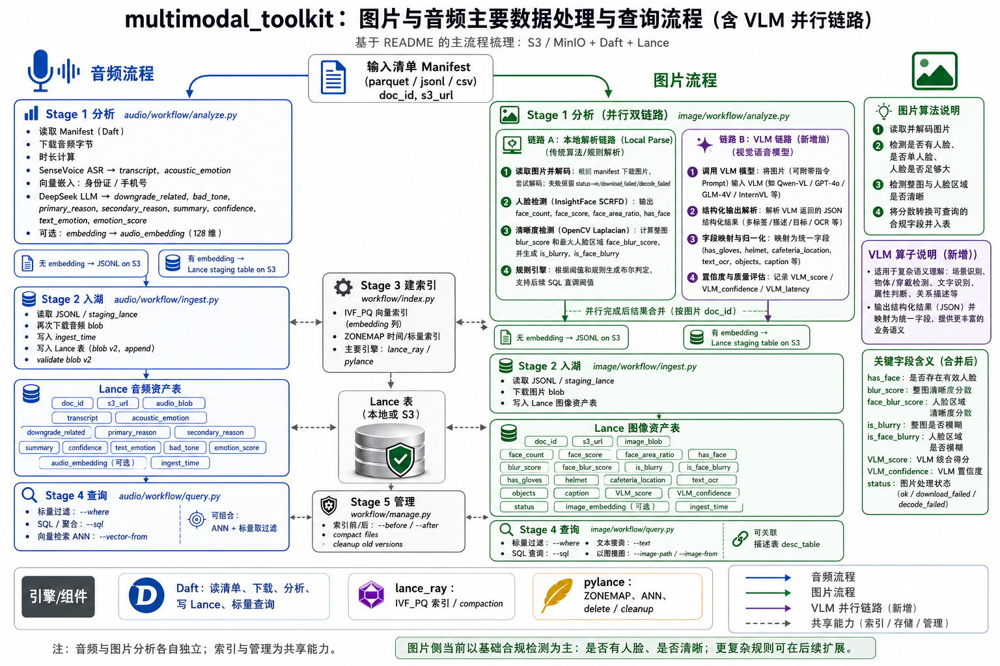

# multimodal_toolkit

音频质检分析 POC：从 S3 读取录音，以 Lance blob v2 存储音频，用 SenseVoice 转写、用 DeepSeek 分析，追加声学 embedding，并支持标量过滤与近邻检索两种查询方式。

同时包含一条图片分析流水线（人脸存在性 + 清晰度检测），与音频管线完全隔离 —— 见下方 [图片工作流](#图片工作流)。

## 总览图



> 说明：图中图片侧的「VLM 并行链路」以及 `has_gloves`、`helmet`、`cafeteria_location`、
> `text_ocr`、`objects`、`caption`、`VLM_score`、`VLM_confidence` 等字段属于**规划中的能力**。
> 当前实现里 `--use-llm` 是**替换**本地人脸/清晰度分析（而非与之并行后合并），资产表字段
> 以下文各小节列出的为准。


## 架构概览

各媒体类型的分析逻辑放在自己的 package 下（`audio/workflow/` 和 `image/workflow/`）。顶层
`workflow/` 只负责与媒体无关的 Lance 表操作，例如建索引和保留期管理。共享的 S3 / Ray 配置
放在 `multimodal_toolkit/config.py`；媒体相关的配置与 schema 放在 `audio/config.py`、
`image/config.py`、`audio/schema.py` 和 `image/schema.py`。

音频管线先跑分析，再把音频 blob 与分析元数据一起写入 Lance 资产表。

## 工作流数据流

```
Manifest (parquet / jsonl / csv)
  doc_id, s3_url
       │
       ▼  Stage 1 — audio/workflow/analyze.py
       │  Daft: 读取 manifest → 下载音频字节 → 时长过滤
       │        → SenseVoice ASR (transcript + acoustic_emotion)
       │        → PII 脱敏（身份证、手机号）
       │        → DeepSeek LLM (downgrade_related, bad_tone, emotion_score …)
       │        → [可选 --embed] audio_embedding（128 维）
       │
       ├── (不带 --embed)  →  S3 上的 JSONL
       └── (带 --embed)    →  S3 上的 Lance staging 表
                │
                ▼  Stage 2 — audio/workflow/ingest.py
                │  Daft: 读取 JSONL 或 Lance staging 表
                │        → 从 s3_url 下载音频 blob
                │        → 打上 ingest_time
                │        → write_lance（blob v2, append）
                │        → 校验 blob v2
                │
                ▼  Lance 资产表（blob v2，本地或 S3）
                │  列：doc_id, s3_url, audio_blob,
                │      transcript, acoustic_emotion,
                │      downgrade_related, primary_reason,
                │      secondary_reason, summary, confidence,
                │      text_emotion, bad_tone, emotion_score,
                │      [audio_embedding], ingest_time
                │
                ▼  Stage 3 — workflow/index.py
                │  lance_ray  : audio_embedding 上的 IVF_PQ 索引
                │  pylance    : ingest_time 上的 ZONEMAP 索引
                │
                ├──▶  Stage 4 — audio/workflow/query.py
                │     Daft SQL (daft.sql())   : --sql    （标量 / 聚合）
                │     Daft scanner 下推        : --where  （标量过滤）
                │     Daft scanner 近邻检索    : --vector-from（ANN，走 IVF 索引）
                │
                └──▶  Stage 5 — workflow/manage.py
                      pylance ds.delete()        : --before / --after
                      lance_ray.compact_files    : delete 之后自动执行
```

### 引擎分工

| 引擎           | 用于                                                                        | 原因                                                        |
|----------------|-----------------------------------------------------------------------------|-------------------------------------------------------------|
| **Daft**       | manifest 读取、S3 下载、ASR/LLM 流水线、Lance 写入（Stage 1 & 2）、标量与 ANN 查询 | 主引擎；API 稳定                                            |
| **lance_ray**  | IVF_PQ 向量索引创建、`compact_files`                                        | Lance 表管理的首选；可用分布式 Ray worker                   |
| **pylance**    | ZONEMAP 标量索引、行删除、`cleanup_old_versions`                            | ZONEMAP：lance_ray 依赖未发布代码；delete：只有这一个 API    |
| **daft_lance** | lance_ray 不可用时 `compact_files` 的兜底                                   | 不用于建索引；Daft 优先原则只适用于数据处理                 |

## 环境准备

```sh
uv sync --upgrade
```

创建 `.env` 文件（或直接 export 环境变量）：

```sh
# S3 / MinIO
MINIO_ENDPOINT=http://127.0.0.1:9000
MINIO_ROOT_USER=minioadmin
MINIO_ROOT_PASSWORD=minioadmin
MINIO_REGION=us-east-1

# LLM —— 留空则跳过 DeepSeek 分析（相关字段为 null）
DEEPSEEK_API_KEY=sk-...
DEEPSEEK_BASE_URL=https://api.deepseek.com
DEEPSEEK_MODEL=deepseek-chat

# ASR 设备
ASR_DEVICE=cpu          # 或 cuda

# Stage 1 的时长过滤
MIN_DURATION_S=0
MAX_DURATION_S=1800

# Stage 1 --embed 使用的 embedding 后端
EMBED_BACKEND=signal    # signal（128 维 RMS+ZCR）或 wav2vec2

# Daft runner
USE_RAY=0               # 设为 1 则 Daft 相关步骤走 Ray
RAY_ADDRESS=            # 留空表示启动/加入本地 Ray
```

### 大规模 Ray 运行的调优参数

下面这些开关都在 workflow 启动时通过 `configure_daft_runner()` / `daft_io_config()` 应用
（Daft 自身只原生读取少数几个 `DAFT_*` 环境变量）。

```sh
# 并行度：analyze 阶段在下载前把 manifest 切成这么多分区。
# 不设置/auto = Ray 上为 2 × 集群 CPU 数，native 上不切分。
ANALYZE_NUM_PARTITIONS=auto

# 内存安全：每个 morsel 的行数。要保持小值 —— 每行都带着图片/音频字节。
DAFT_DEFAULT_MORSEL_SIZE=32

# LLM 并发：每个并行任务的异步请求数。总在途请求数
# = DEEPSEEK_CONCURRENCY × 并行任务数；按服务方限流额度规划。
DEEPSEEK_CONCURRENCY=8

# S3/MinIO：每个 IO 线程的连接数、重试次数、超时（现在确实会生效）。
S3_MAX_CONNECTIONS=8
S3_NUM_TRIES=5
S3_READ_TIMEOUT_MS=60000

# Actor 启动：大量 UDF actor 同时冷启动并下载模型时需要调大。
DAFT_ACTOR_UDF_READY_TIMEOUT=600

# 长任务：开启 Daft 事件日志便于事后排查（Daft 原生读取）。
DAFT_EVENT_LOG_ENABLED=1
DAFT_EVENT_LOG_DIR=/tmp/daft-events
```

输出布局：JSONL 写出时会收敛分区（约 `ANALYZE_NUM_PARTITIONS / 8` 个文件），Lance 写出遵循
`LANCE_MAX_ROWS_PER_FILE` / `LANCE_MAX_BYTES_PER_FILE`，因此高分析并行度不会产生大量小文件或碎片。

## 用法 —— 音频工作流

manifest 必须是 parquet、jsonl 或 csv，至少包含 `doc_id` 和 `s3_url` 两列。
`--lance-uri` 同时支持本地路径和 `s3://` URI。

### Stage 1 —— 分析

从 S3 下载音频，跑 ASR 与 LLM 分析，把结果写回 S3。

```sh
# 输出：JSONL（不含 embedding）
python -m multimodal_toolkit.audio.workflow.analyze \
  --manifest s3://bucket/audio/manifest.parquet \
  --out      s3://bucket/audio/analysis.jsonl

# 输出：Lance staging 表（含 audio_embedding；后续 ANN 检索必需）
python -m multimodal_toolkit.audio.workflow.analyze \
  --manifest s3://bucket/audio/manifest.parquet \
  --out      s3://bucket/audio/staging.lance \
  --embed
```

### Stage 2 —— 入湖

读取 Stage 1 的输出，下载音频 blob，与分析元数据一起追加进 Lance 资产表。

```sh
python -m multimodal_toolkit.audio.workflow.ingest \
  --analysis  s3://bucket/audio/analysis.jsonl \
  --lance-uri s3://bucket/audio/calls.lance
```

如果 Stage 1 带了 `--embed`，则给 `--analysis` 传 `.lance` URI。

### Stage 3 —— 建索引

为快速查询构建索引。等表里行数足够后再跑（IVF_PQ 至少需要 `num_partitions × 256` 行；
小表用 `--num-partitions 1`）。

```sh
# 同时建两种索引（默认）
python -m multimodal_toolkit.workflow.index \
  --lance-uri s3://bucket/audio/calls.lance

# 只建向量索引
python -m multimodal_toolkit.workflow.index \
  --lance-uri s3://bucket/audio/calls.lance \
  --no-time

# 小表调低分区数
python -m multimodal_toolkit.workflow.index \
  --lance-uri s3://bucket/audio/calls.lance \
  --num-partitions 1 --num-sub-vectors 8
```

### Stage 4 —— 查询

```sh
# 标量过滤（通过 read_lance 的 default_scan_options 下推到 Daft）
python -m multimodal_toolkit.audio.workflow.query \
  --lance-uri s3://bucket/audio/calls.lance \
  --where "bad_tone = true OR downgrade_related = true" \
  --top-k 20

# 完整 Daft SQL SELECT（作用域内表名：calls）
python -m multimodal_toolkit.audio.workflow.query \
  --lance-uri s3://bucket/audio/calls.lance \
  --sql "SELECT primary_reason, COUNT(*) AS cnt FROM calls GROUP BY primary_reason ORDER BY cnt DESC"

# 用 Daft SQL 做标量过滤 + 列投影
python -m multimodal_toolkit.audio.workflow.query \
  --lance-uri s3://bucket/audio/calls.lance \
  --sql "SELECT doc_id, emotion_score, primary_reason FROM calls WHERE bad_tone = true AND emotion_score > 0.5 ORDER BY emotion_score DESC" \
  --top-k 20

# 通过 Daft Lance scanner 做 ANN 向量检索（走 IVF 索引）
python -m multimodal_toolkit.audio.workflow.query \
  --lance-uri s3://bucket/audio/calls.lance \
  --vector-from call_001.mp3 \
  --top-k 10

# 组合：ANN + 标量预过滤
python -m multimodal_toolkit.audio.workflow.query \
  --lance-uri s3://bucket/audio/calls.lance \
  --vector-from call_001.mp3 \
  --where "downgrade_related = true" \
  --distance-min 0.0 \
  --distance-max 1.0 \
  --top-k 10
```

### Stage 5 —— 管理

按入湖日期删除行并压缩表：

```sh
# 删除某日期之前入湖的行
python -m multimodal_toolkit.workflow.manage \
  --lance-uri s3://bucket/audio/calls.lance \
  --before 2025-01-01

# 删除日期窗口之外的行
python -m multimodal_toolkit.workflow.manage \
  --lance-uri s3://bucket/audio/calls.lance \
  --after 2024-06-01 --before 2024-12-31
```

删除之后会自动执行 compaction 与版本清理。

## 图片工作流

图片分析位于 `multimodal_toolkit/image/`，与音频管线完全隔离（独立的 workflow 入口、独立的
Lance 资产表），两条线可以各自演进。Stage 3（索引）与 Stage 5（管理）与媒体无关，是共享的。

默认的检测项都在本地完成（不依赖 VLM / 外部 API）：

| 检测项 | 方法 | 输出列 |
|--------|------|--------|
| 人脸存在 / 头像 | InsightFace SCRFD（`buffalo_l`，仅检测模块，CPU）+ 阈值规则 | `face_count`、`face_score`、`face_area_ratio`、`has_face`、`is_avatar` |
| 清晰度 / 模糊 | 图片缩放到 `IMAGE_LONG_EDGE` 后做 OpenCV Laplacian 方差（整图 + 最大人脸裁剪区域） | `blur_score`、`face_blur_score`、`is_blurry`、`is_face_blurry` |
| 图文相似度 | ChineseCLIP（`OFA-Sys/chinese-clip-vit-base-patch16`） | `image_embedding` |

Stage 1 还有一个可选的 `--use-llm` 后端，它用 Daft 原生的 OpenAI 兼容多模态 `prompt`
替换掉本地的人脸/模糊分析。两个后端写出相同的结论列（`has_face`、`is_blurry`、
`is_face_blurry`、`is_avatar`），并在 `analysis_backend` 中标明来源。LLM 独有的
confidence / reason 字段在本地分析下为 null，本地独有的原始分数在 LLM 分析下为 null，
因此两种模式可以追加进同一张表。

所有人脸相关指标（`face_score`、`face_area_ratio`、`face_blur_score`）都取自同一张人脸 ——
最大的那张 —— 这样规则引擎的 AND 条件判断的始终是同一张脸，而不会混用不同检测结果的指标。

布尔结论由阈值规则引擎（`image/rules.py`）从原始分数推导得出；原始分数和结论都会持久化，
因此可以直接用 SQL 重新调阈值而不必重跑模型。这种重调的下界是检测器自身的粗筛阈值
`FACE_DET_THRESH`（默认 0.3）—— 低于它的人脸根本进不了表。

manifest 中每一条都恰好产出一行。失败的条目会保留，用 `status` 列标记
（`ok` / `download_failed` / `decode_failed` / `llm_failed`），分数和结论置 null ——
「未知」与「判定为否」始终可区分，而读不出来的图片本身就是一个可上报的合规信号。

环境变量（均为可选）：

```sh
INSIGHTFACE_MODEL=buffalo_l   # insightface 模型包
INSIGHTFACE_ROOT=             # 预置模型目录，便于离线/容器使用（"" = ~/.insightface）
FACE_DET_SIZE=640             # SCRFD 检测输入尺寸
FACE_DET_THRESH=0.3           # SCRFD 粗筛阈值；要明显低于 FACE_DET_SCORE_MIN
IMAGE_LONG_EDGE=1024          # 检测/模糊计算前把长边缩放到此值（不会放大）
FACE_DET_SCORE_MIN=0.5        # has_face 所需的最小检测分（取最大人脸）
MIN_FACE_RATIO=0.01           # has_face 所需的最小 人脸面积/图片面积 比
BLUR_THRESHOLD=100.0          # blur_score 低于此值 → is_blurry
FACE_BLUR_THRESHOLD=80.0      # face_blur_score 低于此值 → is_face_blurry
AVATAR_MIN_FACE_RATIO=0.03    # 本地 is_avatar 要求存在一张不小于此比例的清晰人脸
IMAGE_EMBED_MODEL=OFA-Sys/chinese-clip-vit-base-patch16
IMAGE_EMBED_DEVICE=cpu
IMAGE_EMBED_DIM=512

# 可选的 OpenAI 兼容图片 VLM（--use-llm）
IMAGE_VLM_API_KEY=
IMAGE_VLM_BASE_URL=https://dashscope.aliyuncs.com/compatible-mode/v1
IMAGE_VLM_MODEL=qwen-vl-plus
IMAGE_VLM_TIMEOUT_S=60
IMAGE_VLM_MAX_RETRIES=2
IMAGE_VLM_CONCURRENCY=1       # 仅在服务方配额允许时才调大
```

首次检测会把 SCRFD 模型包（约 280 MB）下载到 `~/.insightface`；把 `INSIGHTFACE_ROOT`
指向已预置的目录可跳过下载。首次 `--embed` 会通过 Transformers 缓存下载 ChineseCLIP 模型。

```sh
# 灌入示例图片并写出 manifest
python scripts/init_s3.py --media image --data-dir data/images \
  --raw-prefix raw/images --manifest-key image_poc/manifest.parquet

# Stage 1 —— 分析（人脸存在 + 清晰度分数 + 规则结论 → JSONL）
python -m multimodal_toolkit.image.workflow.analyze \
  --manifest s3://contacts/image_poc/manifest.parquet \
  --out      s3://contacts/image_poc/analysis.jsonl

# Stage 1 使用 OpenAI 兼容的视觉模型。图片会被发送到所配置的外部服务，
# 其输出使用与本地分析相同的资产表 schema。
python -m multimodal_toolkit.image.workflow.analyze \
  --manifest s3://contacts/image_poc/manifest.parquet \
  --out      s3://contacts/image_poc/llm-analysis.jsonl \
  --use-llm

# Stage 1 带 embedding —— 文搜图与以图搜图必需
python -m multimodal_toolkit.image.workflow.analyze \
  --manifest s3://contacts/image_poc/manifest.parquet \
  --out      s3://contacts/image_poc/staging.lance \
  --embed

# Stage 2 —— 入湖（图片 blob + 分析元数据 → Lance 图片资产表）
python -m multimodal_toolkit.image.workflow.ingest \
  --analysis  s3://contacts/image_poc/staging.lance \
  --lance-uri s3://contacts/image_poc/assets.lance

# 如果 Stage 1 没带 --embed，就改传 analysis.jsonl。
# 本地批次与 --use-llm 批次可以追加进同一张统一的 Lance 表：
# python -m multimodal_toolkit.image.workflow.ingest \
#   --analysis s3://contacts/image_poc/llm-analysis.jsonl \
#   --lance-uri s3://contacts/image_poc/assets.lance

# Stage 3 —— 为图文相似检索建索引
python -m multimodal_toolkit.workflow.index \
  --lance-uri s3://contacts/image_poc/assets.lance \
  --embedding-column image_embedding

# Stage 4 —— 查询（SQL 作用域内表名：images）
python -m multimodal_toolkit.image.workflow.query \
  --lance-uri s3://contacts/image_poc/assets.lance \
  --where "has_face = true AND is_blurry = false"

python -m multimodal_toolkit.image.workflow.query \
  --lance-uri s3://contacts/image_poc/assets.lance \
  --sql "SELECT doc_id, blur_score, face_count FROM images ORDER BY blur_score ASC"

# 文搜图
python -m multimodal_toolkit.image.workflow.query \
  --lance-uri s3://contacts/image_poc/assets.lance \
  --text "头像" \
  --where "status = 'ok'"

# 以图搜图：来源可以是本地文件，也可以是表里已有的一行
python -m multimodal_toolkit.image.workflow.query \
  --lance-uri s3://contacts/image_poc/assets.lance \
  --image-path ./query.jpg

python -m multimodal_toolkit.image.workflow.query \
  --lance-uri s3://contacts/image_poc/assets.lance \
  --image-from face_001.jpg

# 把描述表（doc_id → description）关联进相似检索结果。
# 该表可以就是一个普通的 parquet/jsonl/csv 文件，无需入湖：
#
#   import pyarrow as pa, pyarrow.parquet as pq
#   pq.write_table(pa.table({
#       "doc_id": ["face_001.jpg", "group_photo.jpg"],
#       "description": ["清晰正面人像", "两人合影"],
#   }), "descriptions.parquet")
#
# 结果会多出一列 `description`（左连接：没有描述的图片仍在结果中，
# description 为 null）。
python -m multimodal_toolkit.image.workflow.query \
  --lance-uri s3://contacts/image_poc/assets.lance \
  --text "合影" \
  --desc-table descriptions.parquet

# 使用 --sql 时，描述表会被注册为 `descriptions`：
python -m multimodal_toolkit.image.workflow.query \
  --lance-uri s3://contacts/image_poc/assets.lance \
  --sql "SELECT i.doc_id, d.description FROM images i LEFT JOIN descriptions d ON i.doc_id = d.doc_id WHERE i.has_face = true" \
  --desc-table descriptions.parquet

# Stage 5 —— 管理（共享入口）
python -m multimodal_toolkit.workflow.manage \
  --lance-uri s3://contacts/image_poc/assets.lance --before 2025-01-01
```

## 已验证的版本

| 组件 | 版本 | 说明 |
|------|------|------|
| Daft | 0.7.15 | 主执行引擎 |
| daft-lance | 0.4.0 | `read_lance`、`write_lance`、`take_blobs`、`create_scalar_index`、`compact_files` |
| pylance | 7.0.0 | Lance dataset、blob v2、ANN scanner、delete、cleanup |
| lance-ray | 0.4.2 | 向量索引创建；写回路径暂缓 |
| Ray | 2.55.1 | 由 lance-ray 引入；除非 `USE_RAY=1`，否则 Daft 走 native runner |

Daft 默认 runner 是 `native`（本地多线程）。设置 `USE_RAY=1` 可把 Daft 相关步骤切到 Ray。
Stage 3（lance_ray 建索引）与 Stage 4 的 ANN（pylance scanner）无论 `USE_RAY` 如何都在本地执行。

## 注意事项与已知限制

**音频在工作流中被下载两次。**
Stage 1 下载音频字节做 ASR 和 embedding；Stage 2 再次下载同样的文件以存为 Lance blob。
这是有意为之 —— 分析输出（JSONL）不在阶段之间携带原始字节。请据此规划带宽成本，或在两个
阶段之间把文件缓存到本地。

**ANN 检索要求 Stage 1 带 `--embed`。**
如果 Stage 1 没带 `--embed`，Lance 资产表就没有 `audio_embedding` 列。此时 Stage 3 会报错，
Stage 4 的 `--vector-from` 也无从检索。需要重跑带 `--embed` 的 Stage 1 并重新入湖。
对于图片表，同一张 Lance 表的所有批次要保持一致：要么所有 Stage 1 都带 `--embed`，要么都不带。
图片入湖步骤会拒绝把带 `image_embedding` 的批次追加到没有该列的表，反之亦然。

**本地分析与 LLM 分析共用一套统一的结论 schema。**
两种模式都写 `has_face`、`is_blurry`、`is_face_blurry`、`is_avatar`，并带上
`analysis_backend = 'local'` 或 `'llm'`。本地的 `is_avatar` 是确定性的「单张清晰人脸」规则；
LLM 的 `is_avatar` 还会额外做语义构图判断。本地独有的检测器分数在 LLM 行中为 null，而 LLM 的
confidence 与 reason 字段在本地行中为 null。VLM 调用失败时仍保留该 manifest 行，
`status = 'llm_failed'` 且结论为 null。Daft 0.7.15 会把 UDF 的 `on_error` 选项泄漏进 OpenAI
请求参数，因此本工作流用了一个小的 descriptor adapter，只剔除泄漏的 UDF 请求参数并跳过 null
图片，同时保留 Daft 原生的 prompt 能力。此统一 schema 之前创建的表不会被迁移；请一次性创建
统一资产表，之后本地批次与 LLM 批次即可共用。

**IVF_PQ 的最小行数要求。**
默认的 `--num-partitions 16` 至少需要 4096 行。行数更少的表请传 `--num-partitions 1`
（或者干脆不建 embedding 索引，只用标量查询）。

**没有 DeepSeek key → LLM 相关列为 null。**
如果没设置 `DEEPSEEK_API_KEY`，`downgrade_related`、`bad_tone`、`primary_reason`、`summary`、
`confidence`、`text_emotion`、`emotion_score` 都会是 `null`。ASR 与声学 embedding 仍正常运行。

**每次入湖后都会校验 blob v2。**
一旦 Lance 悄悄把 `audio_blob` 降级成 `large_binary`，`validate_blob_v2` 会立即抛错。
测试新版本库时绝不要跳过这个检查。

**本地 Lance URI 已做端到端验证。**
S3 上的 Lance 表读写由底层库覆盖，但在本 POC 中应作为一个独立的验证项对待。

**blob v2 资产表的 compaction 暂时禁用。**
当前 `lance-ray 0.4.2` 的向量索引创建依赖 pylance 7.x，而 pylance 8.0.0 虽然修复了 blob v2
compaction，却改动了 `lance-ray 0.4.2` 仍在调用的分布式索引 commit API。项目暂时锁定
`pylance<8.0.0`，Stage 5 在删除行之后跳过 compaction。等升级到 pylance 8.x 并配套兼容的
lance-ray 版本后再重新开启 blob v2 compaction。
